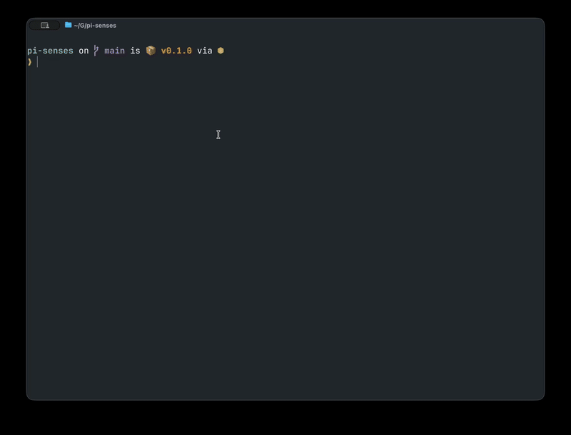

# pi-senses

A [pi](https://github.com/badlogic/pi-mono) extension that allows your agent to interact with macos windows using native features only.

[](assets/demo.mp4)

## Senses

All senses require your terminal to have macos specific permissions:

- **Screen Recording** permission for screenshots
- **Accessibility** permission for focus, click, typing, and key presses

Use `/proprioception` to run a quick check.

### Eyes 👀

With eyes, the agent can see:

- **`senses__eyes__list_windows`** lists all visible windows with their numeric IDs, owner app names, and window titles.
- **`senses__eyes__screenshot_window`** captures a screenshot of a window by its numeric ID (as returned by `senses__eyes__list_windows`) and returns the file path to the image.

#### `/look [description]`

With eyes, the user can direct the agent to look at something:

```
/look ghostty
/look my browser
/look at yourself
/look
```

The command resolves a visible window from your description, captures a screenshot, and prefills your prompt with the image and window metadata.
Edit/enrich the prompt, press Enter, and the screenshot is sent to the model.

- Queries are matched by keyword.
- When that fails, the current model is used to find the best match from the window list.
- If the match is ambiguous, you pick from a shortlist.
- When no description is given, the last captured window is re-captured.

### Hands 🤟

With hands, the agent can interact with windows:

- **`senses__hands__click`** clicks a point in a window by its numeric ID and `(x, y)` coordinates in screenshot pixels. The tool automatically activates the target app, converts pixel coordinates to screen points (accounting for Retina scaling), and performs the click. Note that agents are not that great at estimating pixel positions. In my current experience, Opus is really bad at it, GPT-5.4 is better, but still terrible.
- **`senses__hands__type`** types text into a window. Click a text field first to focus it, then use this tool to enter text character by character.
- **`senses__hands__key`** sends a key press to a window, optionally with modifier keys. Supports named keys (`return`, `tab`, `escape`, `space`, `delete`, `uparrow`, `downarrow`, `leftarrow`, `rightarrow`, `home`, `end`, `pageup`, `pagedown`, `f1`–`f12`) and single characters (`a`–`z`, `0`–`9`, punctuation). Modifiers: `command`, `shift`, `option`, `control`.
